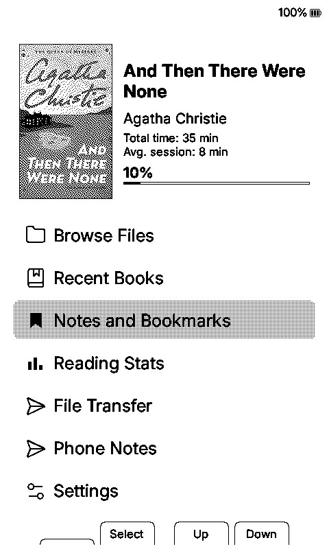
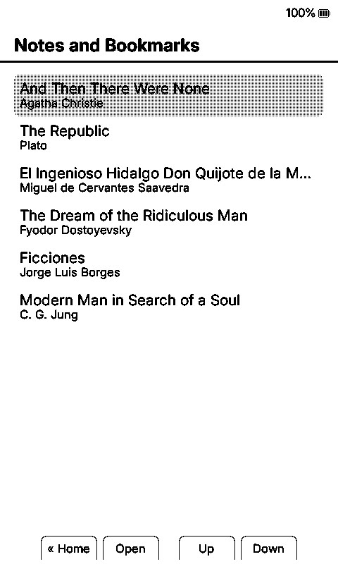
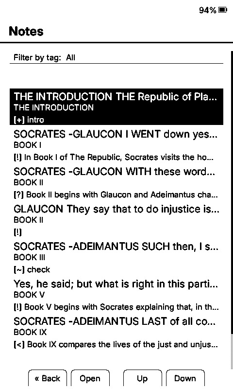
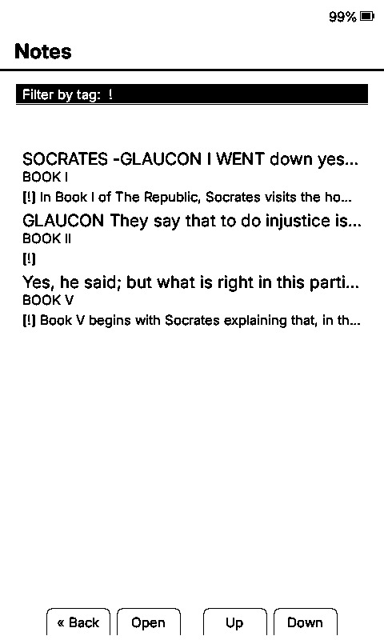
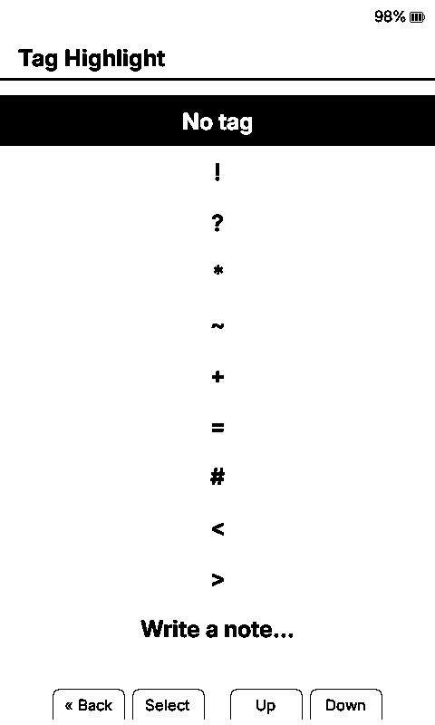
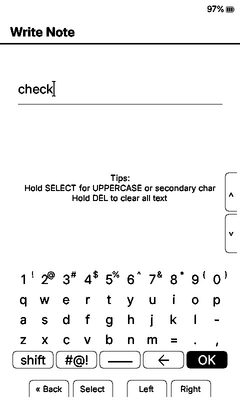
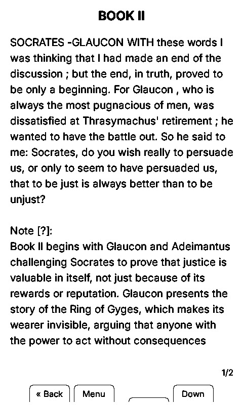
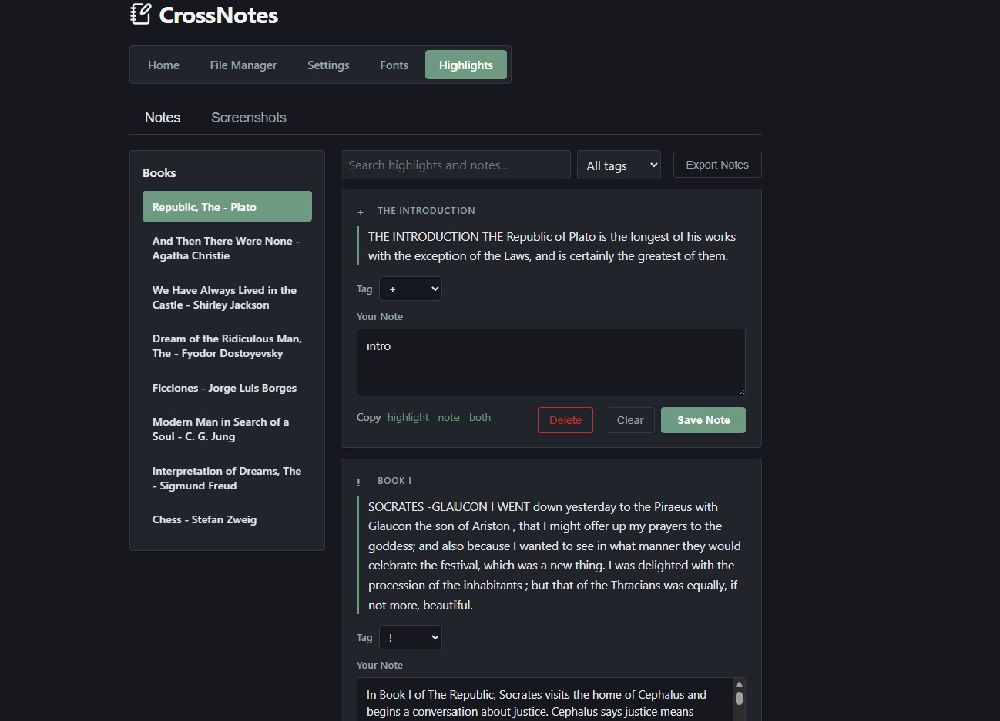

# CrossNotes

A fork of [CrossInk](https://github.com/uxjulia/CrossInk) (CrossInk v1.5.0) which is a fork of CrossPoint. CrossNotes adds annotation features for the Xteink X4 / X3. Aside from that, identical to CrossInk. CrossNotes aims to keep changes from CrossInk minimal, and as close to the original upstream code as possible. All your CrossInk clippings and settings should transfer to CrossNotes without issue.

Download here: [Releases page](https://github.com/HilbergK/CrossNotes/releases)

Highlight a passage, write a note on device and/or tag it. Then open a page in any browser — phone, tablet, laptop — over the device's own Wi-Fi hotspot to view your highlights and edit notes/tags. The notes are stored on the device and shown alongside the highlight within the "Notes and Bookmarks" page.

## What it adds

**On the device**
- Tag picker after every highlight — `!` `?` `*` `~` `+` `=` `#` `<` `>` or no tag, plus a "Write a note…" option using the built-in keyboard
- Tags and note previews shown in the clipping list and detail view
- **Notes and Bookmarks** home entry — browse every book with highlights or bookmarks; Notes and Bookmarks are separate lists per book
- **Notes Connect** home shortcut — starts the hotspot and shows a QR code (and the address to type) straight to the notes page
- Edit Tag / Edit Note / Delete available from the clipping menu (delete asks for confirmation)

**In your browser (phone, tablet or computer)**
- `/highlights` page: read each highlight, set its tag from a dropdown, and type a full note next to it
- **Export Notes** — download all of a book's highlights, tags, and notes as a Markdown file
- **Screenshots** tab: gallery of device screenshots with one-tap download or delete

## How it works

1. Highlight a passage in the reader
2. Tag it (or skip, or write a note directly) — reading resumes immediately
3. Home → **Notes Connect** → scan the QR code, or open the shown address on any device
4. Read your highlights and type notes; they save straight to the device

## Screenshots

<table>
<tr>
<td align="center" width="33%">
<br>
<sub>Home menu — <b>Notes and Bookmarks</b>, <b>Notes Connect</b></sub>
</td>
<td align="center" width="33%">
<br>
<sub>Every book with highlights, notes or bookmarks</sub>
</td>
<td align="center" width="33%">
<br>
<sub>Highlights with their tag and note beneath</sub>
</td>
</tr>
<tr>
<td align="center" width="33%">
<br>
<sub>Filtered to a single tag</sub>
</td>
<td align="center" width="33%">
<br>
<sub>Tag picker after saving a highlight</sub>
</td>
<td align="center" width="33%">
<br>
<sub>Writing a note with the built-in keyboard</sub>
</td>
</tr>
<tr>
<td align="center" width="33%">
<br>
<sub>Highlight detail with its note attached</sub>
</td>
<td align="center" colspan="2">
<br>
<sub>Notes Connect in the browser — read, tag, and write notes from any device</sub>
</td>
</tr>
</table>

## Building & installing

Prebuilt `.bin` files are on the [Releases page](https://github.com/HilbergK/CrossNotes/releases) — see the [installation guide](./docs/installation.md) for the web-based flash tool.

To build from source:

```sh
git clone --recurse-submodules https://github.com/HilbergK/CrossNotes.git
cd CrossNotes
pio run -e default
```

## Credits

Built on [CrossInk](https://github.com/uxjulia/CrossInk) which is built on [CrossPoint Reader](https://github.com/crosspoint-reader/crosspoint-reader). Everything from CrossInk is unchanged. Notes feature developed with Claude. MIT License.
